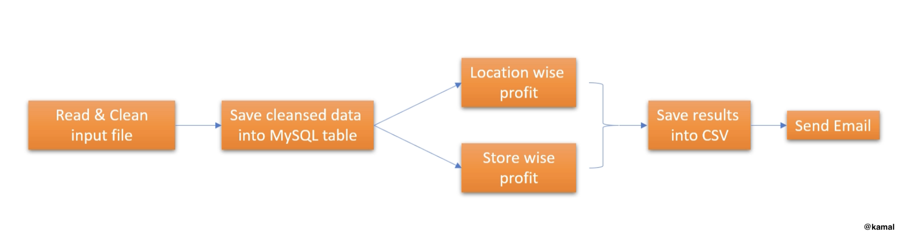

# Retail Store Profit Reports with Apache Airflow

## Project Description

This project demonstrates a data pipeline to generate daily profit reports for a retail client with multiple store locations. The objective is to extract insights from transaction data by calculating store-wise and location-wise profits, using Apache Airflow to manage the ETL workflow.

The project involves processing raw transaction data from CSV files, cleaning and storing it in a database, and generating profit reports in CSV format, which are then emailed to the client.

The raw data is provided daily as a CSV file, with each row representing a transaction from one of the stores.

## Project Workflow

The project is organized as a Directed Acyclic Graph (DAG) in Apache Airflow, breaking down the ETL tasks into individual steps:

### Task Breakdown

1. **Data Ingestion and Cleaning**: 
    - Load the CSV file.
    - Clean the data by removing unwanted special characters from the "Store Location" column.
    - Remove the `$` sign from the "Product MRP" column to enable numerical operations.

2. **Store Cleaned Data**: 
    - Store the cleaned data in a MySQL database for efficient querying and aggregation.

3. **Data Aggregation**: 
    - Using SQL, calculate the following:
      - **Store-wise Profit**: Calculate profit for each store.
      - **Location-wise Profit**: Aggregate profits across all stores within each location.

4. **Report Generation**: 
    - Export the aggregated results to separate CSV files for store-wise and location-wise profits.

5. **Email Report**: 
    - Send the generated reports to the company's specified email address.

## Workflow Diagram

Below is a flowchart that represents the flow of the ETL process for this project:

## Conclusion

This project demonstrates my ability to create an ETL pipeline using Apache Airflow. It demonstrates data cleaning, aggregation, and automation of reporting tasks.

